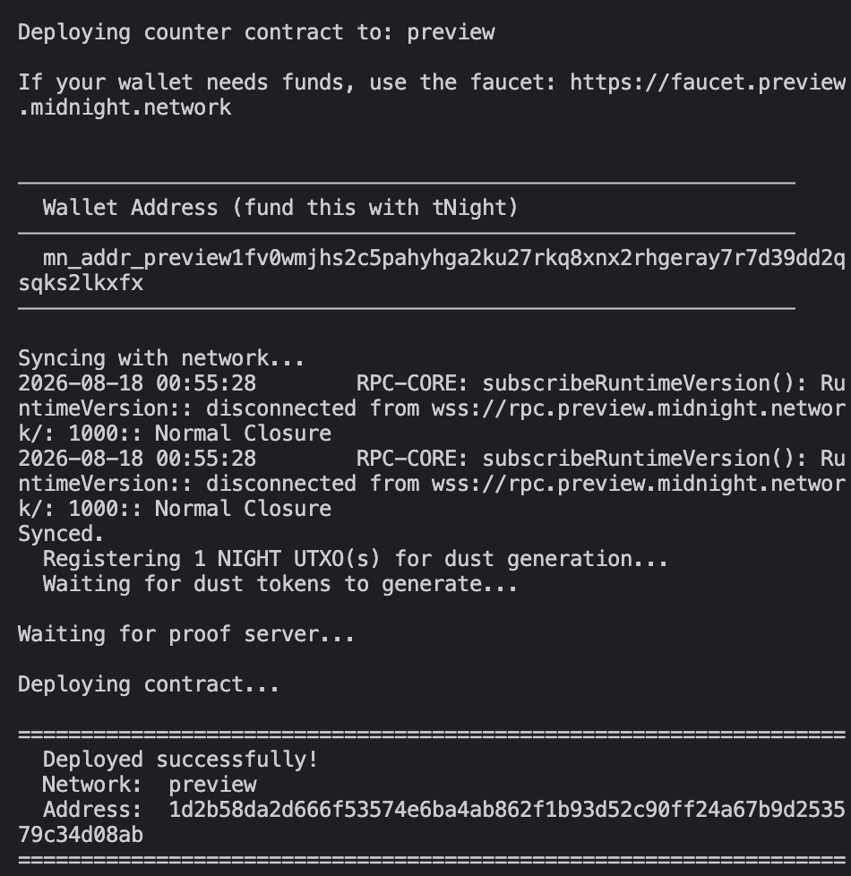
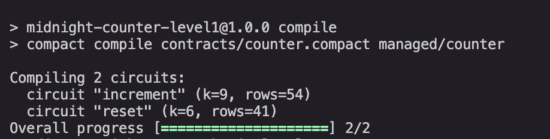

# Privacy-Preserving Counter

> A minimal Compact smart contract on Midnight that proves a counter advanced by a private amount, without revealing that amount.

## Contract Address

| Network | Address |
|---------|---------|
| Preview | `1d2b58da2d666f53574e6ba4ab862f1b93d52c90ff24a67b9d253579c34d08ab` |

## Initial Idea

For Level 1, the goal was to get a real Compact contract deployed end-to-end on Midnight using the simplest possible example: a counter where the current count is public, but the private `increment_by` amount behind each update is never revealed, using Compact's `disclose()` model to make that public/private split explicit.

## What This Does

The contract maintains a public counter that can be incremented or reset. Each increment call takes a private `increment_by` value as a circuit input: it is used inside a zero-knowledge proof to advance the counter, but the amount itself is never written to the chain or revealed to any observer.

## Privacy Model

- **PUBLIC:** `count` — the current counter value, visible to anyone reading the chain.
- **PRIVATE:** `increment_by` — the exact amount added on each `increment` call. This is a private circuit input, consumed inside the ZK proof and never stored on-chain.
- **PROVED without revealing:** that `increment_by > 0`, and that the counter advanced correctly by that amount — without disclosing the actual value of `increment_by`.

## Tech Stack

- Midnight Network (Preview)
- Compact — ZK smart contract language
- Midnight.js SDK (`midnight-js-contracts` v4.1.1)
- Midnight Wallet SDK (`wallet-sdk-facade` v4.1.0)
- Node.js + TypeScript
- Jest

## Prerequisites

- Node.js v22+
- Docker Desktop running
- Compact compiler CLI (`compact`)

## Setup & Run Locally

```bash
git clone <this-repo-url>
cd level-1
npm install --legacy-peer-deps

# Start the proof server (pinned version — do not use :latest or 7.x)
docker run --rm -p 6300:6300 midnightntwrk/proof-server:8.1.0

# Compile the contract
npm run compile

# Run tests
npm run test:run
```

## Deploy

```bash
NODE_OPTIONS="--max-old-space-size=12288" npm run deploy:preview
```

The script prints a wallet address on first run — fund it via the [Preview faucet](https://faucet.preview.midnight.network) before the deploy can complete. The deployed contract address is recorded in `.midnight-state.json` (gitignored) and printed to the console.

## Run Tests

```bash
npm run test:run
```

10 tests passing — circuit logic, state transitions, and privacy isolation (verifying `increment_by` never appears in the public ledger).

## Screenshots





## Project Structure

```
contracts/counter.compact   — the Compact contract
managed/counter/            — compiler output (ZK keys, zkir, compiled JS)
src/network.ts              — network config + seed/deployment persistence
src/wallet.ts                — wallet construction, sync, DUST registration
src/deploy.ts                — deploy script
tests/counter.test.ts        — contract test suite
```
